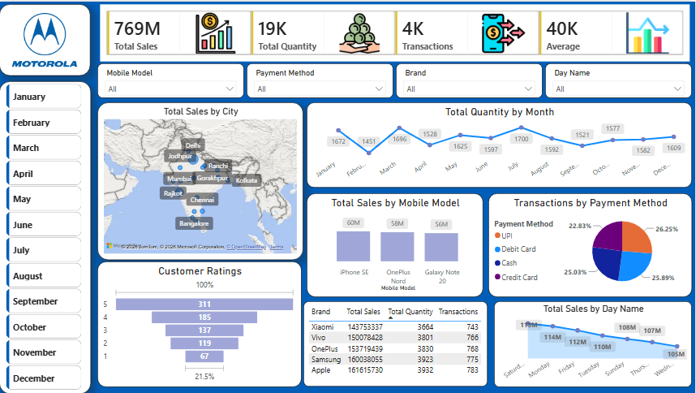

# Motorola Sales Dashboard - Power BI 📊

## Overview
An interactive Power BI dashboard analyzing Motorola's mobile sales data across India.

## Dashboard Highlights
- 📊 Total Sales: 769M
- 📱 Total Quantity: 19K
- 💳 Transactions: 4K
- ⭐ Average: 40K

## Features
- 🗺️ Sales across different cities in India
- 📱 Best selling mobile models
- 💳 Payment method preferences (Cash, UPI, Credit/Debit Card)
- ⭐ Customer ratings & feedback
- 📅 Monthly & daily sales trends

## Tools & Techniques
- Power BI Desktop
- DAX Measures (SUMX, COUNTROWS, AVERAGE)
- Interactive Slicers & Filters
- Maps, Charts, KPI Cards

## Dashboard Preview

